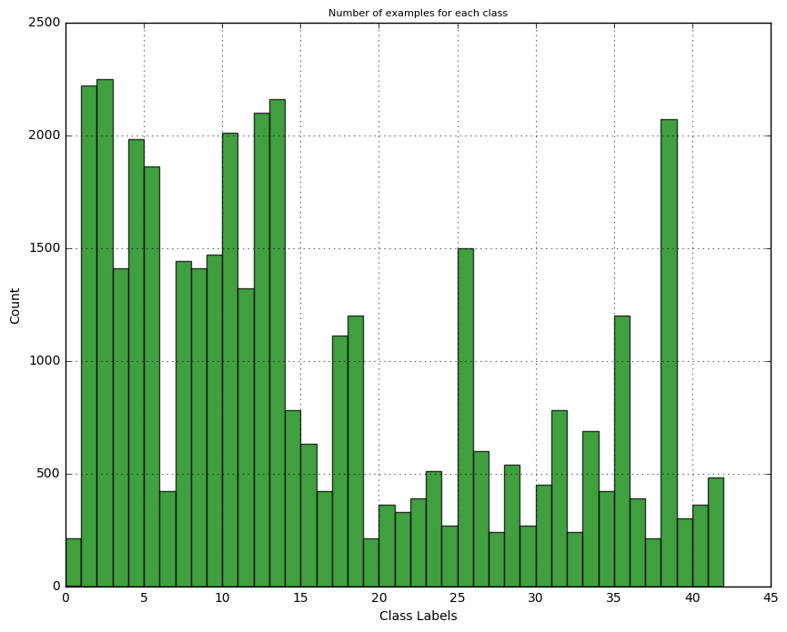
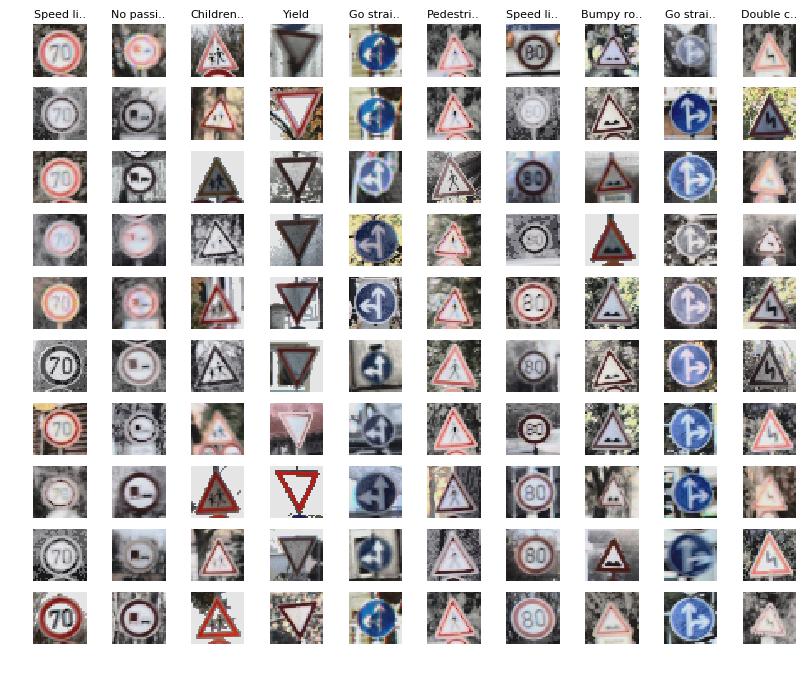
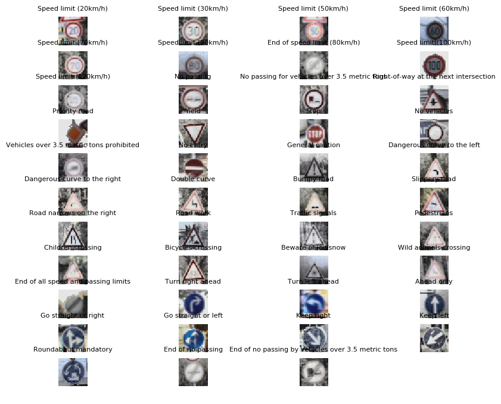
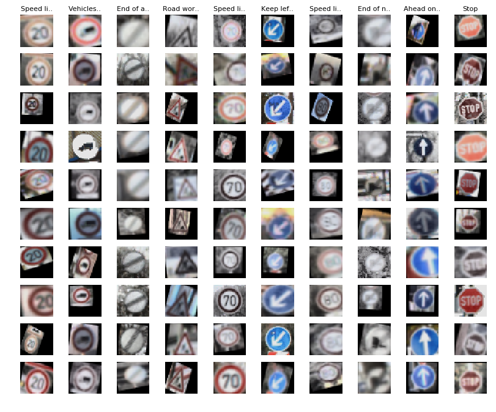
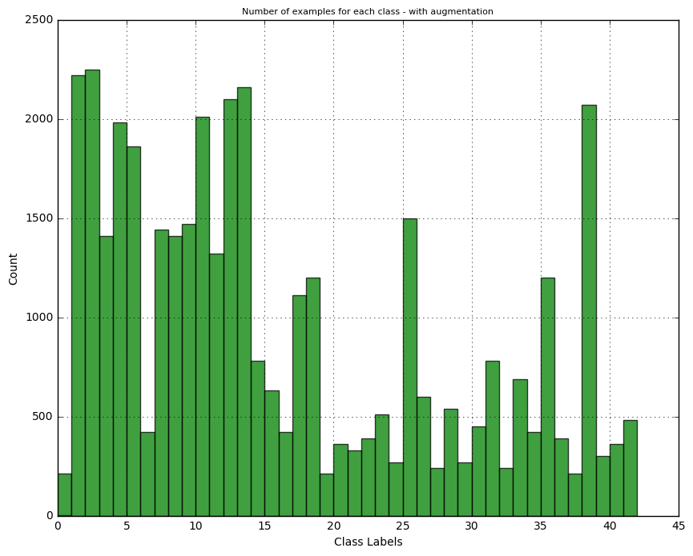
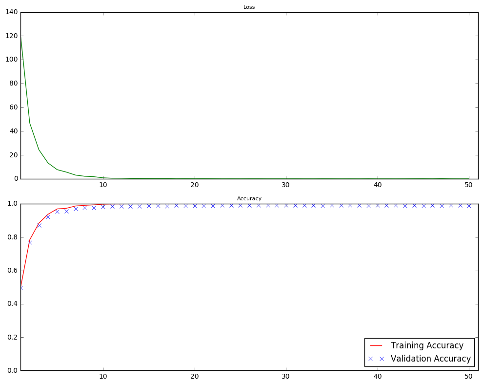
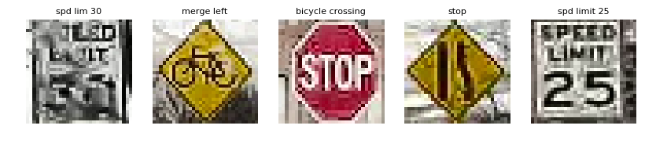
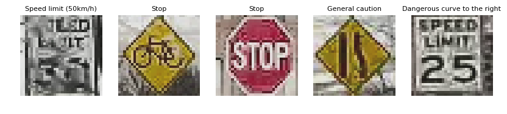
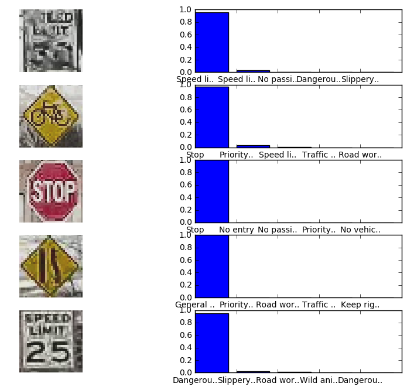

# Self-Driving Car Engineer Nanodegree

## Deep Learning

## Project: Build a Traffic Sign Recognition Classifier

In this notebook, a template is provided for you to implement your functionality in stages which is required to successfully complete this project. If additional code is required that cannot be included in the notebook, be sure that the Python code is successfully imported and included in your submission, if necessary. Sections that begin with **'Implementation'** in the header indicate where you should begin your implementation for your project. Note that some sections of implementation are optional, and will be marked with **'Optional'** in the header.

In addition to implementing code, there will be questions that you must answer which relate to the project and your implementation. Each section where you will answer a question is preceded by a **'Question'** header. Carefully read each question and provide thorough answers in the following text boxes that begin with **'Answer:'**. Your project submission will be evaluated based on your answers to each of the questions and the implementation you provide.

>**Note:** Code and Markdown cells can be executed using the **Shift + Enter** keyboard shortcut. In addition, Markdown cells can be edited by typically double-clicking the cell to enter edit mode.

---
## Step 0: Load The Data


```python
# Imports
import numpy as np
import tensorflow as tf
import pickle
import csv
import cv2
import matplotlib.pyplot as plt

from tqdm import tqdm

# This is a bit of magic to make matplotlib figures appear inline in the notebook
# rather than in a new window.
get_ipython().magic('matplotlib inline')
plt.rcParams['figure.figsize'] = (10.0, 8.0) # set default size of plots
plt.rcParams['image.interpolation'] = 'nearest'
plt.rcParams['image.cmap'] = 'gray'
plt.rcParams['axes.titlesize'] = 8


get_ipython().magic('load_ext autoreload')
get_ipython().magic('autoreload 2')

```


```python
training_file = 'train.p'
testing_file = 'test.p'

with open(training_file, mode='rb') as f:
    train = pickle.load(f)
    
X_train, y_train = train['features'], train['labels']
```

---

## Step 1: Dataset Summary & Exploration

The pickled data is a dictionary with 4 key/value pairs:

- `'features'` is a 4D array containing raw pixel data of the traffic sign images, (num examples, width, height, channels).
- `'labels'` is a 2D array containing the label/class id of the traffic sign. The file `signnames.csv` contains id -> name mappings for each id.
- `'sizes'` is a list containing tuples, (width, height) representing the the original width and height the image.
- `'coords'` is a list containing tuples, (x1, y1, x2, y2) representing coordinates of a bounding box around the sign in the image. **THESE COORDINATES ASSUME THE ORIGINAL IMAGE. THE PICKLED DATA CONTAINS RESIZED VERSIONS (32 by 32) OF THESE IMAGES**

Complete the basic data summary below.

Visualize the German Traffic Signs Dataset using the pickled file(s). This is open ended, suggestions include: plotting traffic sign images, plotting the count of each sign, etc.

The [Matplotlib](http://matplotlib.org/) [examples](http://matplotlib.org/examples/index.html) and [gallery](http://matplotlib.org/gallery.html) pages are a great resource for doing visualizations in Python.

**NOTE:** It's recommended you start with something simple first. If you wish to do more, come back to it after you've completed the rest of the sections.

A histogram of number of examples in each class


```python
n, bins, patches = plt.hist(y_train, bins = np.max(y_train), facecolor='green', alpha=0.75)
plt.xlabel("Class Labels")
plt.ylabel("Count")
plt.title("Number of examples for each class")
plt.grid(True)
plt.show()
```





```python
# Equalize and normalize images
for i, img in enumerate(X_train):
    # Apply histogram equalization on the Y channel. 
    tmp = cv2.cvtColor(img, cv2.COLOR_RGB2YUV)
    tmp[:, :, 0] = cv2.equalizeHist(tmp[:, :, 0])
    X_train[i] = cv2.cvtColor(tmp, cv2.COLOR_YUV2RGB)
    
X_train = 0.1 + X_train * 0.8/255;

```


```python
def plotLabels(X, y, labels):
    num_classes = 43
    for i in range(num_classes):
        idx = np.flatnonzero(y == i)
        idx = np.random.choice(idx, 1)
        plt.subplot(11, 4, i+1)
        plt.imshow(X[idx[0]])
        plt.axis('off')
        plt.title(labels[i], y=1.08)
        
def plotRandomLabelData(X, y, labels, samples_per_class = 10):    
    # Randomly pick a subset of sign to visualize
    cls_labels = np.random.choice(len(labels.keys()), 10, replace=False)
    num_classes = len(cls_labels)
    for ind, lbl in enumerate(cls_labels):
        idxs = np.flatnonzero(y == lbl)
        idxs = np.random.choice(idxs, samples_per_class, replace=False)
        for i, idx in enumerate(idxs):
            plt_idx = i * num_classes + ind + 1
            plt.subplot(samples_per_class, num_classes, plt_idx)
            plt.imshow(X[idx])
            plt.axis('off')
            if i == 0:
               plt.title(labels[lbl])
    plt.show()
    
sign_names = {}

with open('signnames.csv', 'r') as csvfile:
    signreader = csv.reader(csvfile, delimiter=',')
    next(signreader, None)
    for row in signreader:
        sign_names[int(row[0])] = row[1]

str_len = 8
short_signnames = {int(key) : (name[:str_len] + (name[str_len:] and '..')) for key, name in sign_names.items()}       

n_classes = len(sign_names)
```


```python
plotRandomLabelData(X_train, y_train, short_signnames)
```





```python
plotLabels(X_train, y_train, sign_names)
```





----

## Step 2: Design and Test a Model Architecture

Design and implement a deep learning model that learns to recognize traffic signs. Train and test your model on the [German Traffic Sign Dataset](http://benchmark.ini.rub.de/?section=gtsrb&subsection=dataset).

There are various aspects to consider when thinking about this problem:

- Neural network architecture
- Play around preprocessing techniques (normalization, rgb to grayscale, etc)
- Number of examples per label (some have more than others).
- Generate fake data.

Here is an example of a [published baseline model on this problem](http://yann.lecun.com/exdb/publis/pdf/sermanet-ijcnn-11.pdf). It's not required to be familiar with the approach used in the paper but, it's good practice to try to read papers like these.

**NOTE:** The LeNet-5 implementation shown in the [classroom](https://classroom.udacity.com/nanodegrees/nd013/parts/fbf77062-5703-404e-b60c-95b78b2f3f9e/modules/6df7ae49-c61c-4bb2-a23e-6527e69209ec/lessons/601ae704-1035-4287-8b11-e2c2716217ad/concepts/d4aca031-508f-4e0b-b493-e7b706120f81) at the end of the CNN lesson is a solid starting point. You'll have to change the number of classes and possibly the preprocessing, but aside from that it's plug and play!

### Implementation

Use the code cell (or multiple code cells, if necessary) to implement the first step of your project. Once you have completed your implementation and are satisfied with the results, be sure to thoroughly answer the questions that follow.

### Question 1 

_Describe how you preprocessed the data. Why did you choose that technique?_

**Answer:**

All the training (and later testing) images were first converted to YUV color channel and then the histogram equalization was applied on the Y (brightness) channel. This ensures that signs are roughly uniformly lit and have high contrast. In the original data (see the plot of random sample above) many images are darker and barely visible. This transformation fix this problem. Addtionally as a standard feature normalization step, the MinMax normalization was applied to pixel data separately for each color channel to map the values from 0 to 255 to a range of 0.1 to 0.9. 


```python
### Generate data additional data (OPTIONAL!)
### and split the data into training/validation/testing sets here.
### Feel free to use as many code cells as needed.
```


```python
import cv2
# Function thanks to https://github.com/vxy10/ImageAugmentation

def transform_image(img,ang_range,shear_range,trans_range):
    '''
    This function transforms images to generate new images.
    The function takes in following arguments,
    1- Image
    2- ang_range: Range of angles for rotation
    3- shear_range: Range of values to apply affine transform to
    4- trans_range: Range of values to apply translations over.

    A Random uniform distribution is used to generate different parameters for transformation

    '''
    # Rotation
    ang_rot = np.random.uniform(ang_range)-ang_range/2
    rows,cols,_ = img.shape    
    Rot_M = cv2.getRotationMatrix2D((cols/2,rows/2),ang_rot,1)

    # Translation
    tr_x = trans_range*np.random.uniform()-trans_range/2
    tr_y = trans_range*np.random.uniform()-trans_range/2
    Trans_M = np.float32([[1,0,tr_x],[0,1,tr_y]])

    # Shear
    pts1 = np.float32([[5,5],[20,5],[5,20]])
    pt1 = 5+shear_range*np.random.uniform()-shear_range/2
    pt2 = 20+shear_range*np.random.uniform()-shear_range/2
    pts2 = np.float32([[pt1,5],[pt2,pt1],[5,pt2]])
    shear_M = cv2.getAffineTransform(pts1,pts2)

    img = cv2.warpAffine(img,Rot_M,(cols,rows))
    img = cv2.warpAffine(img,Trans_M,(cols,rows))
    img = cv2.warpAffine(img,shear_M,(cols,rows))

    return img

def augment_data(data, labels):
    train_X_new = []
    train_label_new = []

    for i, img in enumerate(data):
        # Randomly generate 5 perturbation for each image. 
        train_X_new.append(img)
        train_label_new.append(labels[i])
        
        for k in range(5):
            train_X_new.append(transform_image(img, 20, 10, 5))
            train_label_new.append(labels[i])
            
    return train_X_new, train_label_new
        
```


```python
train_X_augmented = None
train_label_augmented = None

train_X_augmented, train_label_augmented = augment_data(X_train, y_train) 

train_X_augmented = np.array(train_X_augmented)
train_label_augmented = np.array(train_label_augmented)

```


```python
plotRandomLabelData(train_X_augmented, train_label_augmented, short_signnames)

# Save the data in new pickle file as check-point
data = {}
data['features'] = train_X_augmented
data['labels'] = train_label_augmented

with open('train_augmented.pickle', 'wb') as handle:
    pickle.dump(data, handle, protocol=pickle.HIGHEST_PROTOCOL)

n, bins, patches = plt.hist(y_train, bins = np.max(y_train), facecolor='green', alpha=0.75)
plt.xlabel("Class Labels")
plt.ylabel("Count")
plt.title("Number of examples for each class - with augmentation")
plt.grid(True)
plt.show()

train_X_augmented = None
train_label_augmented = None
```








```python
# Split the training data in training & validation. 

n_train = X_train.shape[0]
image_shape = X_train.shape[1:]
n_classes = 43

from sklearn.model_selection import train_test_split

X_train_split, X_valid, y_train_split, y_valid = train_test_split(X_train,
                                                                  y_train, 
                                                                  test_size=0.2, 
                                                                  random_state=40,
                                                                  stratify=y_train)

print ("Size of training examples", X_train.shape)
print ("Size of training split", X_train_split.shape)
print ("Size of validation ", X_valid.shape)
print("Image data shape =", image_shape)
print("Number of classes =", n_classes)

```

    Size of training examples (39209, 32, 32, 3)
    Size of training split (31367, 32, 32, 3)
    Size of validation  (7842, 32, 32, 3)
    Image data shape = (32, 32, 3)
    Number of classes = 43


### Question 2

_Describe how you set up the training, validation and testing data for your model. **Optional**: If you generated additional data, how did you generate the data? Why did you generate the data? What are the differences in the new dataset (with generated data) from the original dataset?_

**Answer:**

The original training data was augmented by perturbing each image by randomly rotating, shearing and translation the original image. This was repeated five times for each image. The rational behind this augmentaiton is to utilize the abilities of CNN to learn invariance of the input features to their rotation, shear and translation angle. This will not only give us extra data at no additional cost, but could be very practical during detection. During detection (classification) of signs contained in an image, the location of the sign could be at a certain orientation (angle, position, distortion etc) w.r.t origin and our neural network can model this very well. 

Testing data wasn't perturbed, however histogram equalization as described above was applied to each test image. 

Finally, to train our model, the training data was split into 80% training and 20% validation set. The split was done with stratification so the number of output classes follow roughly the same distribution in both the original training/validation. Additionall, the model was first trained on the orignial (un-perturbed) dataset and then later trained (fine tuned) on the augmented data. This was done to redue the training time required to train the model on a large dataset (~5 times) of the original dataset. 


```python
### Define your architecture here.
### Feel free to use as many code cells as needed.
```

### Question 3

_What does your final architecture look like? (Type of model, layers, sizes, connectivity, etc.)  For reference on how to build a deep neural network using TensorFlow, see [Deep Neural Network in TensorFlow
](https://classroom.udacity.com/nanodegrees/nd013/parts/fbf77062-5703-404e-b60c-95b78b2f3f9e/modules/6df7ae49-c61c-4bb2-a23e-6527e69209ec/lessons/b516a270-8600-4f93-a0a3-20dfeabe5da6/concepts/83a3a2a2-a9bd-4b7b-95b0-eb924ab14432) from the classroom._


**Answer:**

The network is based on VGGNet as presented here (https://arxiv.org/pdf/1409.1556.pdf). The original network doesn't have dropout, but I added droput to the feed forward (fully connected) layers to avoid overfitting. 

Below is the diagram of the model followed by the actual implementation in Tensorflow. 


**Layer1**: A 1-by-1 convolution layer to learn the importance of color-channel (if any) to the final prediciton. 

**Layer 2-4**: Convolution layers with varying size 3-by-3 filters folowing by activation function **Relu** and max pooling with kernel size of 2.

**Layer 4-5 **: Fully connected layers

**Layer 6**: Output layer followed by softmax squashing for final probabilities.  


```python
#Implementation of a slightly modified VGGNet (https://arxiv.org/pdf/1409.1556.pdf)

from tensorflow.contrib.layers import flatten

mu = 0
sigma = 0.1

keep_prob = tf.placeholder(tf.float32)

layer_depth = {
    'layer_1' : 3,
    'layer_2' : 32,
    'layer_3' : 64,
    'layer_4' : 128,
    'fully_connected_1' : 1024,
    'fully_connected_2' : 1024,
    'fully_connected_3' : n_classes,
}

weights = {
    'layer_1' : tf.Variable(tf.truncated_normal([3, 3, 3, layer_depth['layer_1']], mean=mu, stddev=sigma)),
    'layer_2' : tf.Variable(tf.truncated_normal([3, 3, layer_depth['layer_1'], layer_depth['layer_2']], mean=mu, stddev=sigma)),
    'layer_3' : tf.Variable(tf.truncated_normal([3, 3, layer_depth['layer_2'], layer_depth['layer_3']], mean=mu, stddev=sigma)),
    'layer_4' : tf.Variable(tf.truncated_normal([3, 3, layer_depth['layer_3'], layer_depth['layer_4']], mean=mu, stddev=sigma)),
    'fully_connected_1' : tf.Variable(tf.truncated_normal([2048, layer_depth['fully_connected_1']], mean=mu, stddev=sigma)),
    'fully_connected_2' : tf.Variable(tf.truncated_normal([layer_depth['fully_connected_1'], layer_depth['fully_connected_2']], mean=mu, stddev=sigma)),
    'fully_connected_3' : tf.Variable(tf.truncated_normal([layer_depth['fully_connected_2'], layer_depth['fully_connected_3']], mean=mu, stddev=sigma))
}

biases = {
    'layer_1' : tf.Variable(tf.zeros(layer_depth['layer_1'])),
    'layer_2' : tf.Variable(tf.zeros(layer_depth['layer_2'])),
    'layer_3' : tf.Variable(tf.zeros(layer_depth['layer_3'])),
    'layer_4' : tf.Variable(tf.zeros(layer_depth['layer_4'])),
    'fully_connected_1' : tf.Variable(tf.zeros(layer_depth['fully_connected_1'])),
    'fully_connected_2' : tf.Variable(tf.zeros(layer_depth['fully_connected_2'])),
    'fully_connected_3' : tf.Variable(tf.zeros(layer_depth['fully_connected_3']))
}

def conv2d(x, W, b, strides=1):
    x = tf.nn.conv2d(x, W, strides=[1, strides, strides, 1], padding='SAME')
    x = tf.nn.bias_add(x, b)
    return tf.nn.relu(x)

def LeNet(x):

    # Layer 1: Convolutional. Input = 32x32x3. Output = 32x33x3
    conv = conv2d(x, weights['layer_1'], biases['layer_1'])

    # Layer 2: Convolutional. Input = 32x32x3. Output = 32x32x32
    conv = conv2d(conv, weights['layer_2'], biases['layer_2'])
    
    # Max Pooling. Input = 32x32x32. Output = 16x16x32
    conv = tf.nn.max_pool(conv, ksize=[1, 2, 2, 1], strides=[1, 2, 2, 1], padding="VALID")

    # Layer 3: Convolutional. Input=16x16x64. 
    conv = conv2d(conv, weights['layer_3'], biases['layer_3'])

    # Max Pooling. Input = 16x16x64. Output = 8x8x64
    conv = tf.nn.max_pool(conv, ksize=[1, 2, 2, 1], strides=[1, 2, 2, 1], padding="VALID")

    # Layer 4: Convolutional. Input=8x8x64. Output = 8x8x128
    conv = conv2d(conv, weights['layer_4'], biases['layer_4'])
    
    # Max Pooling. Input = 8x8*128. Output 4x4x128
    conv = tf.nn.max_pool(conv, ksize=[1, 2, 2, 1], strides=[1, 2, 2, 1], padding="VALID")
    
    conv = flatten(conv)

    # Fully connected layer 1. 
    fc1 = tf.add(tf.matmul(conv, weights['fully_connected_1']),biases['fully_connected_1'])
    fc1 = tf.nn.dropout(tf.nn.relu(fc1), keep_prob) #tf.nn.relu(fc1)

    # Fully connected layer 3.
    fc2 = tf.add(tf.matmul(fc1, weights['fully_connected_2']), biases['fully_connected_2'])
    fc2 = tf.nn.dropout(tf.nn.relu(fc2), keep_prob) #tf.nn.relu(fc2)

    # FC 3
    logits = tf.add(tf.matmul(fc2, weights['fully_connected_3']), biases['fully_connected_3'])
    
    return logits

```


```python
### Train your model here.
### Feel free to use as many code cells as needed.
```


```python
rate = 0.001

x = tf.placeholder(tf.float32, (None, 32, 32, 3))
y = tf.placeholder(tf.int32, (None))
one_hot_y = tf.one_hot(y, n_classes)

logits = LeNet(x)
cross_entropy = tf.nn.softmax_cross_entropy_with_logits(logits, one_hot_y)
loss_operation = tf.reduce_mean(cross_entropy)
optimizer = tf.train.AdamOptimizer(learning_rate = rate)
training_operation = optimizer.minimize(loss_operation)

y_pred = tf.argmax(logits, 1)
correct_prediction = tf.equal(tf.argmax(logits, 1), tf.argmax(one_hot_y, 1))
accuracy_operation = tf.reduce_mean(tf.cast(correct_prediction, tf.float32))
saver = tf.train.Saver()

def evaluate(X_data, y_data, batch_size):
    num_examples = len(X_data)
    total_accuracy = 0
    total_loss = 0
    sess = tf.get_default_session()
    for offset in range(0, num_examples, batch_size):
        batch_x, batch_y = X_data[offset:offset+batch_size], y_data[offset:offset+batch_size]
        loss, accuracy = sess.run([loss_operation, accuracy_operation], feed_dict={x: batch_x, y: batch_y, keep_prob:1.0})
        total_accuracy += (accuracy * len(batch_x))
        total_loss += loss
    return total_loss, total_accuracy / num_examples

```


```python
def run_training_epocs(X_train, y_label, X_valid, y_valid, epochs=10, batch_size=128, restore=False):
    from sklearn.utils import shuffle

    X_train, y_label = shuffle(X_train, y_label)

    loss_epoch = []
    train_acc_epoch = []
    valid_acc_epoch = []

    with tf.Session() as sess:
        if restore:
            saver.restore(sess, tf.train.latest_checkpoint('.'))
        else:
            sess.run(tf.global_variables_initializer())
        
        num_examples = len(X_train_split)

        print("Training...")
        print()
    
        for i in range(epochs):
            X_train, y_label = shuffle(X_train, y_label)
            for offset in range(0, num_examples, batch_size):
                end = offset + batch_size
                batch_x, batch_y = X_train[offset:end], y_label[offset:end]
                sess.run(training_operation, feed_dict={x: batch_x, y: batch_y, keep_prob:0.5})

            training_loss, training_accuracy = evaluate(X_train, y_label, batch_size)
            valid_loss, validation_accuracy = evaluate(X_valid, y_valid, batch_size)
        
            loss_epoch.append(training_loss)
            train_acc_epoch.append(training_accuracy)
            valid_acc_epoch.append(validation_accuracy)
        
            print("EPOCH {} ...".format(i+1))
            print("Training loss = {:.3f}".format(training_loss))
            print("Validation Accuracy = {:.3f}".format(validation_accuracy))
            print()
    
        saver.save(sess, 'vggnet-dropout-v2')
        print("Model saved")
        
        return loss_epoch, train_acc_epoch, valid_acc_epoch

```


```python
# Train the network on the original (un-perturbed) data. 

loss, train_acc, valid_acc = run_training_epocs(X_train_split, 
                                                y_train_split, 
                                                X_valid, 
                                                y_valid, 
                                                epochs=50, 
                                                batch_size=512)

```

    Training...
    
    EPOCH 1 ...
    Training loss = 120.224
    Validation Accuracy = 0.495
    
    EPOCH 2 ...
    Training loss = 46.817
    Validation Accuracy = 0.768
    
    EPOCH 3 ...
    Training loss = 24.378
    Validation Accuracy = 0.872
    
    EPOCH 4 ...
    Training loss = 13.276
    Validation Accuracy = 0.921
    
    EPOCH 5 ...
    Training loss = 7.660
    Validation Accuracy = 0.952
    
    EPOCH 6 ...
    Training loss = 5.625
    Validation Accuracy = 0.957
    
    EPOCH 7 ...
    Training loss = 3.120
    Validation Accuracy = 0.971
    
    EPOCH 8 ...
    Training loss = 2.133
    Validation Accuracy = 0.976
    
    EPOCH 9 ...
    Training loss = 1.763
    Validation Accuracy = 0.978
    
    EPOCH 10 ...
    Training loss = 0.841
    Validation Accuracy = 0.983
    
    EPOCH 11 ...
    Training loss = 0.495
    Validation Accuracy = 0.985
    
    EPOCH 12 ...
    Training loss = 0.452
    Validation Accuracy = 0.986
    
    EPOCH 13 ...
    Training loss = 0.282
    Validation Accuracy = 0.986
    
    EPOCH 14 ...
    Training loss = 0.224
    Validation Accuracy = 0.987
    
    EPOCH 15 ...
    Training loss = 0.152
    Validation Accuracy = 0.987
    
    EPOCH 16 ...
    Training loss = 0.100
    Validation Accuracy = 0.990
    
    EPOCH 17 ...
    Training loss = 0.144
    Validation Accuracy = 0.986
    
    EPOCH 18 ...
    Training loss = 0.047
    Validation Accuracy = 0.991
    
    EPOCH 19 ...
    Training loss = 0.072
    Validation Accuracy = 0.988
    
    EPOCH 20 ...
    Training loss = 0.051
    Validation Accuracy = 0.989
    
    EPOCH 21 ...
    Training loss = 0.072
    Validation Accuracy = 0.989
    
    EPOCH 22 ...
    Training loss = 0.054
    Validation Accuracy = 0.990
    
    EPOCH 23 ...
    Training loss = 0.019
    Validation Accuracy = 0.990
    
    EPOCH 24 ...
    Training loss = 0.027
    Validation Accuracy = 0.990
    
    EPOCH 25 ...
    Training loss = 0.019
    Validation Accuracy = 0.991
    
    EPOCH 26 ...
    Training loss = 0.042
    Validation Accuracy = 0.990
    
    EPOCH 27 ...
    Training loss = 0.041
    Validation Accuracy = 0.990
    
    EPOCH 28 ...
    Training loss = 0.019
    Validation Accuracy = 0.992
    
    EPOCH 29 ...
    Training loss = 0.024
    Validation Accuracy = 0.990
    
    EPOCH 30 ...
    Training loss = 0.020
    Validation Accuracy = 0.991
    
    EPOCH 31 ...
    Training loss = 0.035
    Validation Accuracy = 0.991
    
    EPOCH 32 ...
    Training loss = 0.017
    Validation Accuracy = 0.992
    
    EPOCH 33 ...
    Training loss = 0.013
    Validation Accuracy = 0.991
    
    EPOCH 34 ...
    Training loss = 0.044
    Validation Accuracy = 0.990
    
    EPOCH 35 ...
    Training loss = 0.034
    Validation Accuracy = 0.991
    
    EPOCH 36 ...
    Training loss = 0.012
    Validation Accuracy = 0.992
    
    EPOCH 37 ...
    Training loss = 0.023
    Validation Accuracy = 0.991
    
    EPOCH 38 ...
    Training loss = 0.010
    Validation Accuracy = 0.992
    
    EPOCH 39 ...
    Training loss = 0.048
    Validation Accuracy = 0.989
    
    EPOCH 40 ...
    Training loss = 0.004
    Validation Accuracy = 0.992
    
    EPOCH 41 ...
    Training loss = 0.015
    Validation Accuracy = 0.992
    
    EPOCH 42 ...
    Training loss = 0.003
    Validation Accuracy = 0.992
    
    EPOCH 43 ...
    Training loss = 0.020
    Validation Accuracy = 0.990
    
    EPOCH 44 ...
    Training loss = 0.046
    Validation Accuracy = 0.992
    
    EPOCH 45 ...
    Training loss = 0.064
    Validation Accuracy = 0.988
    
    EPOCH 46 ...
    Training loss = 0.031
    Validation Accuracy = 0.990
    
    EPOCH 47 ...
    Training loss = 0.114
    Validation Accuracy = 0.989
    
    EPOCH 48 ...
    Training loss = 0.025
    Validation Accuracy = 0.991
    
    EPOCH 49 ...
    Training loss = 0.006
    Validation Accuracy = 0.990
    
    EPOCH 50 ...
    Training loss = 0.023
    Validation Accuracy = 0.989
    
    Model saved


```python
EPOCHS = 50

loss_plot = plt.subplot(211)
loss_plot.set_title('Loss')
loss_plot.plot(range(1, EPOCHS+1), loss, 'g')
loss_plot.set_xlim([1, EPOCHS+1])

acc_plot = plt.subplot(212)
acc_plot.set_title('Accuracy')
acc_plot.plot(range(1, EPOCHS+1), train_acc, 'r', label='Training Accuracy')
acc_plot.plot(range(1, EPOCHS+1), valid_acc, 'x', label='Validation Accuracy')
acc_plot.set_ylim([0, 1.0])
acc_plot.set_xlim([1, EPOCHS+1])
acc_plot.legend(loc=4)
plt.tight_layout()
plt.show()


```





```python
# Load the augmented data for fine tuning the network.  
training_augmented_file = 'train_augmented.pickle'

with open(training_augmented_file, mode='rb') as f:
   train = pickle.load(f)
    
X_train, y_train = train['features'], train['labels']

from sklearn.model_selection import train_test_split

X_train_split, X_valid, y_train_split, y_valid = train_test_split(X_train,
                                                                  y_train, 
                                                                  test_size=0.2, 
                                                                  random_state=40,
                                                                  stratify=y_train)

print ("Size of training examples", X_train.shape)
print ("Size of training split", X_train_split.shape)
print ("Size of validation ", X_valid.shape)
print("Image data shape =", image_shape)
print("Number of classes =", n_classes)

```

    Size of training examples (235254, 32, 32, 3)
    Size of training split (188203, 32, 32, 3)
    Size of validation  (47051, 32, 32, 3)
    Image data shape = (32, 32, 3)
    Number of classes = 43


```python

# Fine tune the network on perturbed data. 
loss, train_acc, valid_acc = run_training_epocs(X_train_split, 
                                                y_train_split, 
                                                X_valid, 
                                                y_valid, 
                                                epochs=50, 
                                                batch_size=512,
                                                restore=True)

```

    Training...
    
    EPOCH 1 ...
    Training loss = 85.805
    Validation Accuracy = 0.917
    
    EPOCH 2 ...
    Training loss = 45.808
    Validation Accuracy = 0.946
    
    EPOCH 3 ...
    Training loss = 28.388
    Validation Accuracy = 0.958
    
    EPOCH 4 ...
    Training loss = 19.390
    Validation Accuracy = 0.964
    
    EPOCH 5 ...
    Training loss = 14.661
    Validation Accuracy = 0.969
    
    EPOCH 6 ...
    Training loss = 10.923
    Validation Accuracy = 0.972
    
    EPOCH 7 ...
    Training loss = 9.439
    Validation Accuracy = 0.972
    
    EPOCH 8 ...
    Training loss = 10.050
    Validation Accuracy = 0.972
    
    EPOCH 9 ...
    Training loss = 5.352
    Validation Accuracy = 0.976
    
    EPOCH 10 ...
    Training loss = 4.593
    Validation Accuracy = 0.977
    
    EPOCH 11 ...
    Training loss = 4.149
    Validation Accuracy = 0.977
    
    EPOCH 12 ...
    Training loss = 3.935
    Validation Accuracy = 0.978
    
    EPOCH 13 ...
    Training loss = 2.737
    Validation Accuracy = 0.980
    
    EPOCH 14 ...
    Training loss = 3.678
    Validation Accuracy = 0.978
    
    EPOCH 15 ...
    Training loss = 3.048
    Validation Accuracy = 0.979
    
    EPOCH 16 ...
    Training loss = 3.514
    Validation Accuracy = 0.979
    
    EPOCH 17 ...
    Training loss = 3.228
    Validation Accuracy = 0.978
    
    EPOCH 18 ...
    Training loss = 3.891
    Validation Accuracy = 0.979
    
    EPOCH 19 ...
    Training loss = 3.309
    Validation Accuracy = 0.979
    
    EPOCH 20 ...
    Training loss = 1.288
    Validation Accuracy = 0.982
    
    EPOCH 21 ...
    Training loss = 2.770
    Validation Accuracy = 0.980
    
    EPOCH 22 ...
    Training loss = 3.688
    Validation Accuracy = 0.979
    
    EPOCH 23 ...
    Training loss = 5.685
    Validation Accuracy = 0.976
    
    EPOCH 24 ...
    Training loss = 1.509
    Validation Accuracy = 0.982
    
    EPOCH 25 ...
    Training loss = 0.887
    Validation Accuracy = 0.983
    
    EPOCH 26 ...
    Training loss = 2.207
    Validation Accuracy = 0.981
    
    EPOCH 27 ...
    Training loss = 1.772
    Validation Accuracy = 0.982
    
    EPOCH 28 ...
    Training loss = 1.045
    Validation Accuracy = 0.983
    
    EPOCH 29 ...
    Training loss = 0.709
    Validation Accuracy = 0.985
    
    EPOCH 30 ...
    Training loss = 1.284
    Validation Accuracy = 0.983
    
    EPOCH 31 ...
    Training loss = 0.830
    Validation Accuracy = 0.985
    
    EPOCH 32 ...
    Training loss = 0.917
    Validation Accuracy = 0.984
    
    EPOCH 33 ...
    Training loss = 0.791
    Validation Accuracy = 0.984
    
    EPOCH 34 ...
    Training loss = 1.569
    Validation Accuracy = 0.982
    
    EPOCH 35 ...
    Training loss = 1.141
    Validation Accuracy = 0.983
    
    EPOCH 36 ...
    Training loss = 1.037
    Validation Accuracy = 0.984
    
    EPOCH 37 ...
    Training loss = 0.777
    Validation Accuracy = 0.985
    
    EPOCH 38 ...
    Training loss = 1.280
    Validation Accuracy = 0.984
    
    EPOCH 39 ...
    Training loss = 1.308
    Validation Accuracy = 0.983
    
    EPOCH 40 ...
    Training loss = 0.988
    Validation Accuracy = 0.984
    
    EPOCH 41 ...
    Training loss = 0.870
    Validation Accuracy = 0.984
    
    EPOCH 42 ...
    Training loss = 1.087
    Validation Accuracy = 0.983
    
    EPOCH 43 ...
    Training loss = 2.593
    Validation Accuracy = 0.981
    
    EPOCH 44 ...
    Training loss = 0.544
    Validation Accuracy = 0.985
    
    EPOCH 45 ...
    Training loss = 1.016
    Validation Accuracy = 0.984
    
    EPOCH 46 ...
    Training loss = 0.814
    Validation Accuracy = 0.985
    
    EPOCH 47 ...
    Training loss = 0.690
    Validation Accuracy = 0.985
    
    EPOCH 48 ...
    Training loss = 1.076
    Validation Accuracy = 0.983
    
    EPOCH 49 ...
    Training loss = 0.801
    Validation Accuracy = 0.985
    
    EPOCH 50 ...
    Training loss = 0.541
    Validation Accuracy = 0.987
    
    Model saved


```python
import sklearn as sk

BATCH_SIZE=2048

p = 0.0
r = 0.0
f = 0.0
c = 0

with tf.Session() as sess:
    saver.restore(sess, tf.train.latest_checkpoint('.'))   
    for offset in range(0, len(y_valid), BATCH_SIZE):
        end = offset + BATCH_SIZE
        batch_x, batch_y = X_valid[offset:end], y_valid[offset:end]
        y_prediction = sess.run(y_pred, feed_dict={x:batch_x, y:batch_y, keep_prob : 1.0})
    
        
        p = p + sk.metrics.precision_score(batch_y, y_prediction, average='weighted')
        
        r = r + sk.metrics.recall_score(batch_y, y_prediction, average='weighted')
        f = f + sk.metrics.f1_score(batch_y, y_prediction, average='weighted')
        
        c = c + 1
    
p = p / c
r = r / c
f = f / c

print (p, r, f)
```

    0.987020513888 0.986654263035 0.986644515605


```python
# Moment of truth: How well our model perfom on the test data. 
testing_file = 'test.p'

with open(testing_file, mode='rb') as f:
    test = pickle.load(f)

test_X, y_test = test['features'], test['labels']


for i, img in enumerate(test_X):
    tmp = cv2.cvtColor(img, cv2.COLOR_RGB2YUV)
    tmp[:, :, 0] = cv2.equalizeHist(tmp[:, :, 0])
    img = cv2.cvtColor(tmp, cv2.COLOR_YUV2RGB)
    test_X[i] = img

test_X = 0.1 + test_X * 0.8/255

with tf.Session() as sess:
    saver.restore(sess, tf.train.latest_checkpoint('.'))

    loss, test_accuracy = evaluate(test_X, y_test, batch_size=512)
    print ("Test Accuracy = {:.3f}".format(test_accuracy))
```

    Test Accuracy = 0.971


### Question 4

_How did you train your model? (Type of optimizer, batch size, epochs, hyperparameters, etc.)_


**Answer:**

The optimizer used was Adam optimizer for its ability to dynamically adjust the learning rate. The batch size, epochs and learning rate were decided based on the systematic exploration of these parameters. Here is the rough sketch of these experiments:

a) First, The batch size was fixed to 256 and epochs to 30
b) We let the network train with a learning rate starting at 0.1 and decreasing it manually as the loss is plateaued. 
c) At the end of the run model is saved on the disk. 
c) If the model is still improving, we can run it for more EPOCHS by first restoring the saved model (instead of reinitializing the weights).

The performance of model was evaluated against validation set (~20%) of training data. The model was evaluated against test set only once! To ensure that we are not overfitting, I used suggestions from (cs231n.github.io/neural-networks-3/#baby). The plot of validation/training accuracy (as shown above) was used to avoid the case. Additionally, the addition of drop-out layer also provided some confidence to avoid overfitting. 

Final model was trained with following values of the hyper-parameters:

batch_size = 256 or 512 (Finally picked 512)
learning rate = 0.001 (lower rates were very slow and higher rates gave very poor results)
EPOCHS = manually set in the increment of 30, until the loss is plateaued. 

### Question 5


_What approach did you take in coming up with a solution to this problem? It may have been a process of trial and error, in which case, outline the steps you took to get to the final solution and why you chose those steps. Perhaps your solution involved an already well known implementation or architecture. In this case, discuss why you think this is suitable for the current problem._

**Answer:**

As with the case in many deep learning problem, you start with an existing network and improve upon it. I tried two different networks 

a) LeNet (from the class)
b) VGGNet+dropout (https://arxiv.org/pdf/1409.1556.pdf)

**LeNet** Tried different variation of the dataset and it performed well on the original dataset but with the augmented dataset the results were rather poor. 

**VGGNet+droput** My final solution is based on this network. There are different reasons to pick this architecture.(i) The network is known to perform really well with the image data as apparent from the fact that it was a runner up of the  ILSVRC 2014 copmetition. (ii) The depth and memory requirement for the network was just right for the GPU available to me for training (iii) After doing a lot of fine tuning of LeNet, I wasn't getting any major performance gain so it was time to try a more deeper network. 

---

## Step 3: Test a Model on New Images

Take several pictures of traffic signs that you find on the web or around you (at least five), and run them through your classifier on your computer to produce example results. The classifier might not recognize some local signs but it could prove interesting nonetheless.

You may find `signnames.csv` useful as it contains mappings from the class id (integer) to the actual sign name.

### Implementation

Use the code cell (or multiple code cells, if necessary) to implement the first step of your project. Once you have completed your implementation and are satisfied with the results, be sure to thoroughly answer the questions that follow.


```python
### Load the images and plot them here.
### Feel free to use as many code cells as needed.
```


```python
image_dir = 'traffic_signs/'

from os import listdir
files = [f for f in listdir(image_dir)]

captured_images = []
titles = ["spd lim 30", "merge left", "bicycle crossing", "stop", "spd limit 25"]
for i, file in enumerate(files):
    img = cv2.imread("%s/%s"%(image_dir, file))    
    img = cv2.resize(img, (32, 32))
    tmp = cv2.cvtColor(img, cv2.COLOR_BGR2YUV)
    tmp[:, :, 0] = cv2.equalizeHist(tmp[:, :, 0])
    img = cv2.cvtColor(tmp, cv2.COLOR_YUV2RGB)

    plt.subplot(1, 5, i+1)
    plt.axis("off")
    plt.imshow(img)
    plt.title(titles[i])
    captured_images.append(img)

captured_images = np.array(captured_images)
```





### Question 6

_Choose five candidate images of traffic signs and provide them in the report. Are there any particular qualities of the image(s) that might make classification difficult? It could be helpful to plot the images in the notebook._


**Answer:**

The above cell shows 5 candidate images of US traffic signs (obtained from a dash-cam video that I recorded earlier). Among these 5 signs, the **stop** sign is the only one that our model has seen in some variation. The remaining signs are either completly non-existent in our training set (Merge left) or have very different shape/structure. 

The US speed signs are square with more textual information. The German speed limit size are circular with only a number written on them.

The background of these signs is little different. Although normalization is mitigating this to some degree, but more pre-processing might be require for these signs to be equal in this respect.  

One of the sign is obstructed by snow on it. This is probably going to make it much more harder to classify. 


```python
### Run the predictions here.
### Feel free to use as many code cells as needed.
```


```python
# Pre-processing
captured_images = 0.1 + captured_images * 0.8/255

```


```python
saver = tf.train.import_meta_graph('vggnet-dropout-v2.meta')
with tf.Session() as sess:
    saver.restore(sess, tf.train.latest_checkpoint('.'))
    y = sess.run(y_pred, feed_dict={x: captured_images, keep_prob:1.0})

print (y)
for i, img in enumerate(captured_images):
    plt.subplot(1, 5, i+1)
    plt.axis("off")
    plt.title(sign_names[y[i]])
    plt.imshow(img)

```

    [ 2 14 14 18 20]





### Question 7

_Is your model able to perform equally well on captured pictures when compared to testing on the dataset? The simplest way to do this check the accuracy of the predictions. For example, if the model predicted 1 out of 5 signs correctly, it's 20% accurate._

_**NOTE:** You could check the accuracy manually by using `signnames.csv` (same directory). This file has a mapping from the class id (0-42) to the corresponding sign name. So, you could take the class id the model outputs, lookup the name in `signnames.csv` and see if it matches the sign from the image._


**Answer:**

The model didn't perform that well on the captured images with accuracy of only 20% as the only correctly classified sign was the stop sign. 


```python
### Visualize the softmax probabilities here.
### Feel free to use as many code cells as needed.
```


```python
# Softmax probabilites. 

with tf.Session() as sess:
    saver.restore(sess, tf.train.latest_checkpoint('.'))
    y = sess.run(tf.nn.top_k(tf.nn.softmax(logits), 5), feed_dict={x: captured_images, keep_prob:1.0})
    
k = 1
for i, img in enumerate(captured_images):
    plt.subplot(5, 2, k)
    plt.axis("off")
    plt.imshow(img)
    plt.subplot(5, 2, k+1)
    lbls = [short_signnames[x] for x in y.indices[i]]
    plt.bar(range(5), y.values[i])
    plt.xticks(range(5), lbls)
    k = k +  2

```





### Question 8

*Use the model's softmax probabilities to visualize the **certainty** of its predictions, [`tf.nn.top_k`](https://www.tensorflow.org/versions/r0.12/api_docs/python/nn.html#top_k) could prove helpful here. Which predictions is the model certain of? Uncertain? If the model was incorrect in its initial prediction, does the correct prediction appear in the top k? (k should be 5 at most)*

`tf.nn.top_k` will return the values and indices (class ids) of the top k predictions. So if k=3, for each sign, it'll return the 3 largest probabilities (out of a possible 43) and the correspoding class ids.

Take this numpy array as an example:

```
# (5, 6) array
a = np.array([[ 0.24879643,  0.07032244,  0.12641572,  0.34763842,  0.07893497,
         0.12789202],
       [ 0.28086119,  0.27569815,  0.08594638,  0.0178669 ,  0.18063401,
         0.15899337],
       [ 0.26076848,  0.23664738,  0.08020603,  0.07001922,  0.1134371 ,
         0.23892179],
       [ 0.11943333,  0.29198961,  0.02605103,  0.26234032,  0.1351348 ,
         0.16505091],
       [ 0.09561176,  0.34396535,  0.0643941 ,  0.16240774,  0.24206137,
         0.09155967]])
```

Running it through `sess.run(tf.nn.top_k(tf.constant(a), k=3))` produces:

```
TopKV2(values=array([[ 0.34763842,  0.24879643,  0.12789202],
       [ 0.28086119,  0.27569815,  0.18063401],
       [ 0.26076848,  0.23892179,  0.23664738],
       [ 0.29198961,  0.26234032,  0.16505091],
       [ 0.34396535,  0.24206137,  0.16240774]]), indices=array([[3, 0, 5],
       [0, 1, 4],
       [0, 5, 1],
       [1, 3, 5],
       [1, 4, 3]], dtype=int32))
```

Looking just at the first row we get `[ 0.34763842,  0.24879643,  0.12789202]`, you can confirm these are the 3 largest probabilities in `a`. You'll also notice `[3, 0, 5]` are the corresponding indices.

**Answer:**

The model is fairly certain about its prediction as the weight for the first prediciton is very high 0.8 to 0.9. As shown in the bar chart, the incorrectly labeled signs didn't have the correct label in the top 5 predictions. 

> **Note**: Once you have completed all of the code implementations and successfully answered each question above, you may finalize your work by exporting the iPython Notebook as an HTML document. You can do this by using the menu above and navigating to  \n",
    "**File -> Download as -> HTML (.html)**. Include the finished document along with this notebook as your submission.


```python

```
